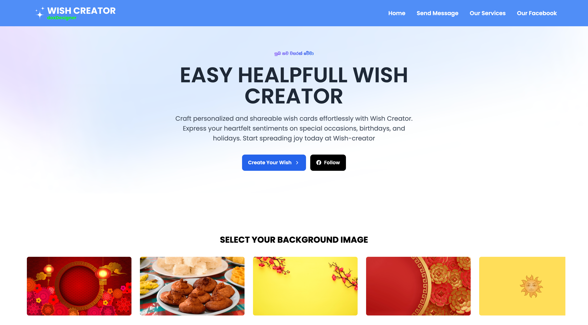

# Wish Creator

[](public/screenshot.png)

A modern web application for creating and sharing personalized wishes. Designed for ease of use, beautiful presentation, and quick sharing.

## Key Features
- Create custom wish cards with unique backgrounds
- Browse a carousel of wish templates
- Instant preview and download of wishes
- Responsive design for mobile and desktop
- Share wishes via message or social media

## Technologies Used
- React
- Vite
- Tailwind CSS
- JavaScript (ES6+)
- PostCSS

## Getting Started

Follow these steps to run the project locally:

1. **Clone the repository:**
   ```bash
   git clone https://github.com/JanishkaM/Wish_Creator.git
   cd Wish_Creator
   ```
2. **Install dependencies:**
   ```bash
   npm install
   ```
3. **Start the development server:**
   ```bash
   npm run dev
   ```
4. **Open in browser:**
   Visit [http://localhost:5173](http://localhost:5173) or open `index.html` directly for a static preview.

## Folder Structure
```
Wish_Creator/
├── public/
│   ├── flyer.png
│   ├── icon.png
│   └── screenshot.png
├── src/
│   ├── App.jsx
│   ├── main.jsx
│   ├── index.css
│   ├── assets/
│   │   ├── css/
│   │   │   └── wish-card.css
│   │   ├── icons/
│   │   │   └── logo.png
│   │   └── images/
│   │       └── [wish_bg_*.png, ImageFileNames.js, etc.]
│   ├── components/
│   │   └── [Ads.jsx, Carousel.jsx, ...]
│   ├── data/
│   │   └── Images.js
│   ├── pages/
│   │   └── [Home.jsx, SendMessage.jsx, WishCard.jsx]
│   └── utils/
│       └── image-util.js
├── index.html
├── package.json
├── tailwind.config.js
├── postcss.config.js
└── vite.config.js
```

## Credits
- Inspired by various online wish card creators and open-source React projects
- Assets and icons from [Unsplash](https://unsplash.com/) and [Flaticon](https://www.flaticon.com/)

## License

This project is licensed under the MIT License. See the [LICENSE](LICENSE) file for details.
